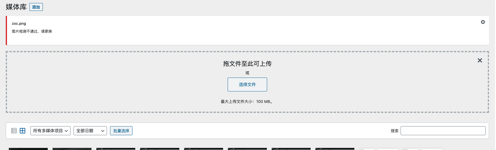
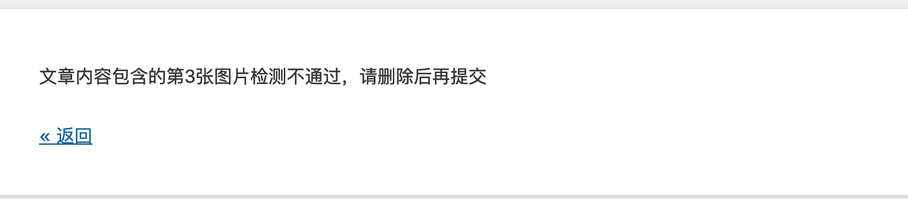

# 腾讯云图片内容安全插件

## 1.插件介绍
> tencentcloud-ims插件是一款腾讯云研发的，提供给WordPress站长使用的官方插件。对用户在媒体库上传、通过URL插入的图片出现违规涉黄、爆、恐的内容，进行内容检测和过滤功能

| 标题       | 内容                                                         |
| ---------- | ------------------------------------------------------------ |
| 中文名称      | 腾讯云图片内容安全（IMS）插件                                         |
| 英文名称   | tencentcloud-ims                                       |
| 最新版本   | v1.0.1 (2020.12.11)                                           |
| 适用平台 | [WordPress](https://wordpress.org/)                             |
| 适用产品 | [腾讯云图片内容安全（IMS）](https://cloud.tencent.com/product/ims) |
| 文档中心   | [春雨文档中心](https://openapp.qq.com/docs/Wordpress/ims.html) |
| 主创团队   | 腾讯云中小企业产品中心（SMB Product Center of Tencent Cloud）                     |

## 2.功能特性

- 对用户在媒体库上传、通过URL插入的图片使用腾讯云图片内容安全接口进行内容检测和过滤

## 3.安装指引

### 3.1.部署方式一：通过GitHub部署安装

> 1. git clone https://github.com/Tencent-Cloud-Plugins/tencentcloud-wordpress-plugin-ims.git
> 2. 复制 tencentcloud-ims文件夹到 WordPress安装路径/wp-content/plugins/文件夹里面

### 3.2.部署方式二：通过WordPress插件中心安装
> 1. 前往[WordPress插件中心](https://wordpress.org/plugins/tencentcloud-ims)点击下载
> 2. 你的WordPress站点后台=》插件=》安装插件。点击左上角的"上传插件"按钮，选择上一步下载的zip安装包

### 3.3.部署方式三：通过WordPress站点后台安装
> 1. 你的WordPress站点后台=》插件=》安装插件。在页面搜索框输入tencentcloud-ims
> 2. 点击"安装"按钮，就会自动下载安装插件

## 4.使用指引

### 4.1.界面功能介绍

> 后台配置页面。配置介绍请参考下方的[名词解释](#_4-2-名词解释)

> 对媒体库上传的图片进行检测，检测不通过将会提示如上信息

> 对发文章时上传的图片进行检测，检测不通过将会提示如上信息

### 4.2.名词解释
- **自定义密钥：** 插件提供统一密钥管理，既可在多个腾讯云插件之间共享SecretId和SecretKey，也可为插件配置单独定义的腾讯云密钥。
- **Secret ID：** 在[腾讯云API密钥管理](https://console.cloud.tencent.com/cam/capi)上申请的标识身份的 SecretId。
- **Secret Key：** 在[腾讯云API密钥管理](https://console.cloud.tencent.com/cam/capi)上申请的与SecretId对应的SecretKey。
- **审核URL图片：** 对写文章时通过URL插入的图片进行检测审核。

## 5.获取入口

| 插件入口          | 链接                                                         |
| ----------------- | ------------------------------------------------------------ |
| GitHub            | [link](https://github.com/Tencent-Cloud-Plugins/tencentcloud-wordpress-plugin-ims)   |

## 6.FAQ

> 暂无

## 7.GitHub版本迭代记录

### 2020.12.11 tencentcloud-wordpress-plugin-ims v1.0.1
- 支持在windows环境下运行

### 2020.6.22 tencentcloud-wordpress-plugin-ims v1.0.0
- 对用户在媒体库上传、通过URL插入的图片使用腾讯云图片内容安全接口进行内容检测和过滤
---
本项目由腾讯云中小企业产品中心建设和维护，了解与该插件使用相关的更多信息，请访问[春雨文档中心](https://openapp.qq.com/docs/Wordpress/ims.html) 

请通过[咨询建议](https://support.qq.com/products/164613) 向我们提交宝贵意见i